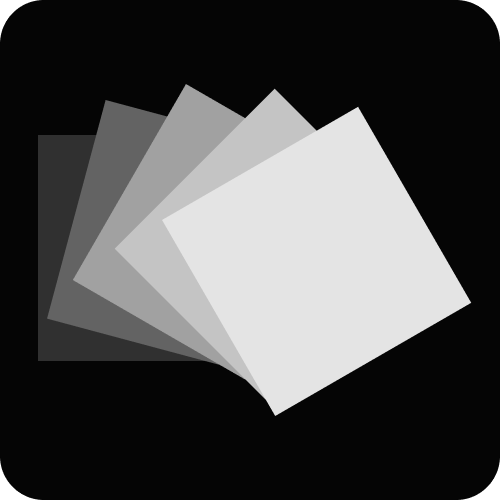

#  TheOpenPresenter

**TheOpenPresenter** is an ambitious project aiming to be the final presenter software you'll ever need.
It achieves this through its modular architecture, allowing for endless customization and features tailored to your specific needs.

[Try it now!](https://theopenpresenter.com)

## Status: Production ready, actively developed

TheOpenPresenter is stable and in production use today. It runs live every week at real venues, and you can use it now through https://theopenpresenter.com. Development is active and ongoing, with new features and improvements landing regularly.

### Developer wiki

We maintain a separate wiki page at https://docs.theopenpresenter.com. Please refer to this site for anything technical relating to this project. If anything is unclear or missing, please do contact us and we'll try our best to explain it better.

## What is TheOpenPresenter?

**Our mission is to provide the most user-friendly solution to present any media to any of your screens.**

✅ Present in any device that can run a browser  
✅ Collaborate & control presentation from anywhere  
✅ Play video from various sources (Youtube, local, etc)  
✅ Organize your past and future presentation sessions   
✅ Record audio and save it for future playback  
✅ Import & display lyrics from various sources with ease  
✅ Display slides from many different sources   
🟨 Offline app support - Beta (currently only for Windows)  

Last but not least, the code for TheOpenPresenter will always be Open Source. We also promise to keep a hosted version of TheOpenPresenter free for those that will benefit from it the most such as small churches and select non-profit organizations.

### Who is it for?

If you put content on a screen in front of people, TheOpenPresenter is for you. We see it used across a few kinds of venues:

- **Coworking spaces & community halls** - let guests and members present from their own devices, no cables or setup help needed.
- **Event venues** - hand presenting clients a link and let them run their own slides, photos, or videos.
- **Houses of worship** - present lyrics, slides, and media to your congregation, with multiple people collaborating in real time.
- **Camps & conferences** - drive a main screen, confidence monitor, and signage from one synchronised show.

The project is built with a focus on smaller venues. More advanced, enterprise-grade features may land further on in the development cycle.

## Every Contribution Makes a Difference

We welcome contributions of any kind, including blog posts, tutorials, translations, testing, writing documentation, and pull requests. Our [Developer Wiki](https://docs.theopenpresenter.com) contains all the information necessary for you to get started.

## Thank you, open source

TheOpenPresenter makes use of numerous open-source projects and we are deeply grateful. We hope that by offering TheOpenPresenter as a free, open-source project, we can help others in the same way these programs have helped us.

We would like to particularly thank [graphile/starter](https://github.com/graphile/starter) as this repo started from there. Many of the features here would have taken much longer otherwise.

This project is tested with BrowserStack

## License

Licensed under the AGPL License.