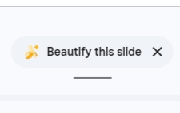
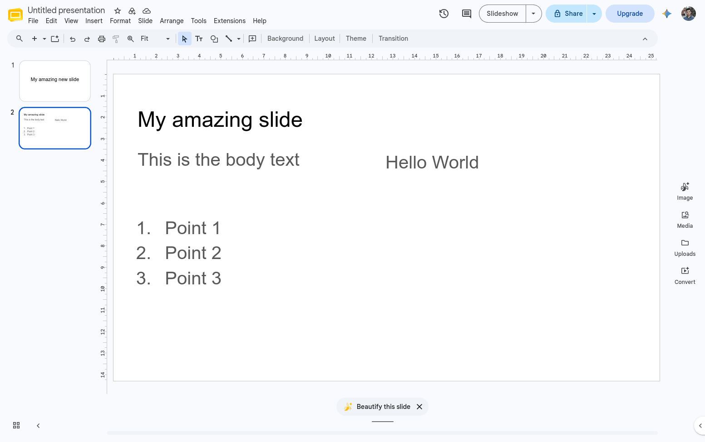
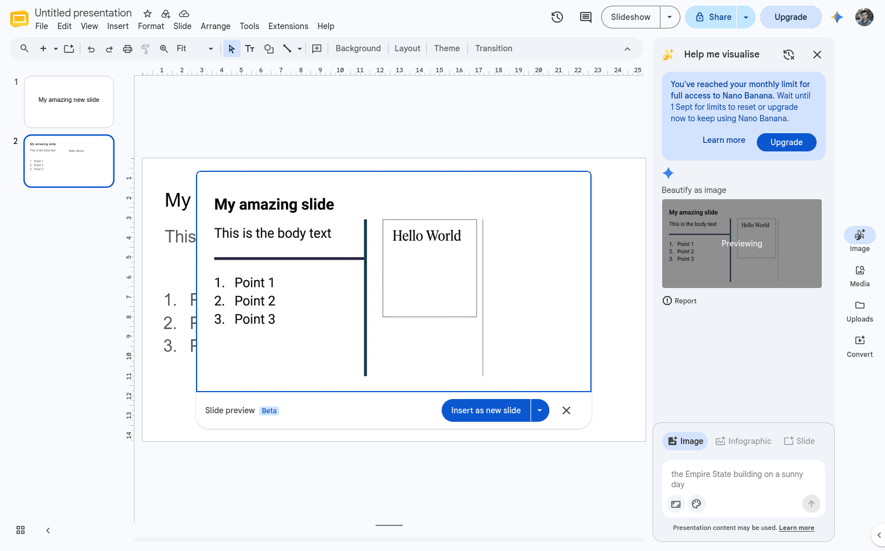
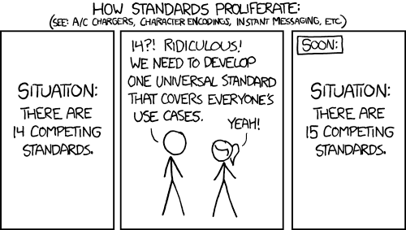

I was making a slide in Google Slides recently when a small button appeared at the bottom: **Beautify the slide.**

When I clicked it, it made an image instead of updating my slides directly 🤦

I think that says something bigger about AI in office apps. The model is not the main problem. The file format is.

## I thought it might have improved

A few months ago, I spent some time trying AI features in office apps. I tried Google Slides and Sheets to see what they could do. They were clunky and didn't help at all. But they were experimental so that made sense. I even had to go out of my way to enable them.

This time, I didn't have to look for anything. Google Slides added a panel on the right with templates and AI features, and this "Beautify" button appeared suddenly. Since Google was now putting it in front of me, no reason not to try it!

*Original slide*

I had a normal slide with a heading and body, nothing too interesting. I expected Beautify to maybe move things around, fix the spacing, line up the boxes, or choose better sizes.

Instead, it generated an image from my slide with "improvements".

The result looks... fine. But it's now a picture. Meaning I can't move it, correct any typo, or any other adjustment I see fit.

*Resulting slide*

## My theory: the format is the constraint

AI models are very powerful nowadays. If they can generate pictures & videos, they can surely work with slides.

However, the data model of these slides are probably a large legacy structure with years of edge cases in it, and you have to guarantee you won't corrupt a billion existing documents.

For the image path, all they need to do is take a screenshot and hook it up to their existing model. Done, shipped in a quarter.

## Example of AI working with plain format

I saw a project called [Bento](https://bento.page/) posted a few weeks ago. It's slides in a single HTML file. I think there's 2 things great about it:
1. Everything bundled into one
2. The data model is simple for both humans and AI

In fact, the HTML file already includes prompts for an LLM to know how to work with the file.

I think moving forward, having **a simple data model is the future of most AI powered apps**. Don't get me wrong, it's already very important without AI. But I think it's going to get even more so.

## Slideshow apps need a standard format

If you've had to do anything programmatic with PowerPoint before, you know how much of a pain it can be. This is the hidden cost of proprietary software. Of course Google slides is not much better. I wrote an article on my journey to [reverse engineer Google slides here](https://theopenpresenter.com/blog/reverse-engineering-google-slides/).

**We need a shared data model for slide apps**

There are already some of course. ODP has existed for decades. The problem is it's not built for the AI age.

I am making one more format anyway.

*xkcd 927*

Yes I know, another one?

I'm building the future of presentation software called TheOpenPresenter. And the data model should be simple enough that a person can read it and an AI can work with it. Bento was a good example of how simple it can be.

I'm also not going to pretend I can make a new industry standard happen. Lots of smarter people have tried for a long time. First I need to make something that works well in TOP. If it stays simple, works well with AI, and proves useful outside TOP, maybe I can extract it into its own project later. Maybe then other people will want to use it too.

## See it working

TheOpenPresenter stores its presentations as plain JSON today and I've recently hooked it up into AI.

It can read the slide structure, move an element, change text, add a new slide, or remove something that should not be there.

<figure>
  <video src="/videos/blog/google-slides-ai-is-laughably-bad/ai-demo.mp4" autoplay loop muted playsinline></video>
  <figcaption>AI editing a presentation in TheOpenPresenter</figcaption>
</figure>

There's a lot more that can be improved. But for version 1, I'd say that this is a huge success.
