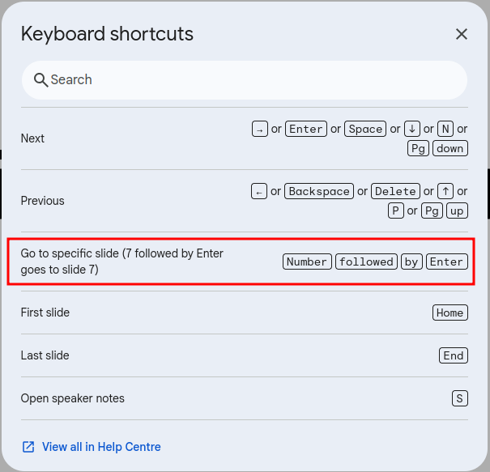
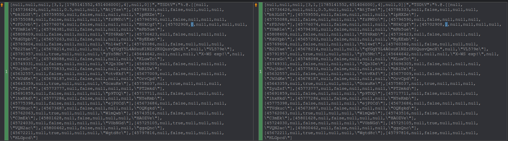

I'm a big fan of Google Slides. As someone who often helps out with multimedia at events, I much prefer receiving Google Slides over a PowerPoint file. This is for two main reasons. For one, it's so much easier to collaborate with. The other side can update the slides at any time without a back and forth. Secondly, I use Linux, so opening a PowerPoint file often leads to style issues, usually from missing fonts.

So when building TheOpenPresenter, support for Google Slides was one of the first things that came to mind.

The requirements are simple:

1. I should be able to import the slides easily
2. I should be able to control the slides remotely

And oh man, I can tell you that it was an iterative process.

## The easy way out: export to PDF

Most integrations with slides software simply export a PDF file. This is nice because you won't get any issues with styles. Google Slides also has an API to do this.

The obvious downside is that it will be a static image. Personally that's fine for me. But try telling that to people who just want their slides to work :)

As far as I can tell, nobody has done an integration that allows something like this before.

## Part 1: Controlling an embed remotely

The obvious starting point is looking at embedding Google Slides directly into the software. They do provide a URL for this. Great!

Now the harder question: how do I control it programmatically without having direct access to the embed? This is the main essence of this article.

Going to the next and previous slides was easy enough. All I needed to do was simulate the left and right arrow.

```tsx
iframeRef.current?.contentDocument?.dispatchEvent(
  new KeyboardEvent("keydown", { key: "ArrowRight", keyCode: 39 }),
);
```

But how about jumping to different slides? I could spam the arrows, but that doesn't seem reliable.

### Experimenting with different URL parameters

The first thing I did was look through the source code to see if there's a function I can call. The first thing I noticed is that there are a few flags you can pass to the embed URL that put it into different modes.

They didn't end up being all that useful. I did however find that the slides are anchored, meaning I can pass `#slide3` at the end of the URL to navigate to different slides. However, after a bit of testing, that method wasn't too reliable due to a [bug in WebKit](https://bugs.webkit.org/show_bug.cgi?id=24578).

<figure>
  <video src="/videos/blog/reverse-engineering-google-slides/anchor-navigation.mp4" autoplay loop muted playsinline></video>
  <figcaption>Changing slides through embed UI</figcaption>
</figure>

Another lead was this navigation button. If I can find the function that leads there, I can simply call that function. Given that it's public, of course. But after diving deep into the code, my hopes were slowly fading. Remember, this is obfuscated code, so it's not an easy task to understand what's actually happening.

### Using keyboard shortcuts instead

After sitting on it for a few days, I noticed that Google Slides has some keyboard shortcuts. Particularly, there is a shortcut to jump to a specific slide!



And sure enough, that worked. So going to a specific slide is as simple as:

```tsx
slideIWantToGoTo
  .toString()
  .split("")
  .map((x) => keyCodeMapping[x])
  .forEach((keyCode) => {
    iframeRef.current?.contentDocument?.dispatchEvent(
      new KeyboardEvent("keydown", { keyCode }),
    );
  });
iframeRef.current?.contentDocument?.dispatchEvent(
  new KeyboardEvent("keydown", { key: "Enter", keyCode: 13 }),
);
```

## Part 2: Accessing the data

At this point I can move the slides around. But there's still a lot of hooking up to do.

I don't know how many slides there are. I don't know which slides have animations, or how many clicks each one needs. I don't know how long a transition takes. Without that, the remote is just a pair of arrow buttons firing blindly into a black box.

So where does that data live?

Turns out it's all sitting right there in the HTML document of the embed. There's a big JSON blob in there with everything I need. Great news!

The bad news is that it's completely undocumented, and it's not a nice object with keys to tell me what it is. It's arrays upon arrays upon arrays. There's nothing to tell you what index 7 is supposed to mean. It looks something like this:

```text
[null,null,null,[3,1,[1785141552,451406000],4],null,0]]","TSDtV":"%.@.[[null,[[45736426,null,null,0.5,null,null,\"AtjTse\"],[45798333,null,false,null,null,null,\"bk3LGf\"],[45759550,null,false,null,null,null,\"ipHXZe\"],[45755088,null,false,null,null,null,\"fzPMYc\"],[45796590,null,false,null,null,null,\"rFDJvb\"],
[45776074,null,false,null,null,null,\"H0kCgf\"],[45702908,0,null,null,null,null,\"YUmR1e\"],[45794381,null,false,null,null,null,\"mPb5ue\"],[45808609,null,false,null,null,null,\"SY6Rxb\"],[45736423,null,false,null,null,null,\"KdGYpb\"],[45657263,null,false,null,null,null,\"ByEExb\"],[45769604,null,false,null,null,null,\"h14wf\"],[45760386,null,false,null,null,null,\"B22Yae\"],…
```

You get the idea. We'll come back to decoding that. First there's a bigger problem.

### I ended up hosting Google Slides myself

The embed workflow works as a demo. However, I don't want people to have to:

- Make their slides public
- Copy and paste the slide ID or URL into my software

Most people are also probably presenting internal slides. Making it public would be a privacy issue.

Thankfully, we can access the embedded HTML just by modifying the URL slightly and by passing their OAuth token. The problem with this is that I don't want to hold people's tokens too much, since that'll be a security nightmare.

I went back and forth on a few approaches here, but I ended up simply hosting Google Slides myself.

What I mean is: save the embed HTML and serve it through my server.

With this approach, I just need to access the data once and be done with it. This has the added benefit of being able to run everything offline.

Is this hacky? Very. But it works.

### And then it broke

This worked well for a while. And then one day it didn't. And with this kind of hacky workaround, the error wasn't very obvious either. Thankfully I anticipated this and implemented a PDF workaround. So once I saw it break in an event I was running, it was as simple as toggling the rendering mode. This meant that we didn't have animation, but we didn't use it anyway.

Back to the story. After a lot of poking around, I found that some of the images weren't loading. And sometimes the embed HTML would also not load.

It would work in the beginning, but after a few hours it would eventually error. My best guess is that Google implemented some kind of cache that would expire a few hours after access.

So what's the fix? Well, save everything! So I had to download all the images as well and save them to TheOpenPresenter's media library.

## Part 3: Tracking and matching Google's behaviour

Now one final thing: how do we know where we are in the slides? Without animations this is easy. Press right, you're on the next slide. Keep a counter and the remote stays in sync.

But with animations, pressing right doesn't necessarily mean you moved to the next slide. One slide might have five elements that appear one at a time. So a right press could mean "reveal the next bullet point", or it could mean "go to the next slide", and from the outside those look exactly the same.

If I get that wrong by even one press, the remote is out of sync for the rest of the presentation.

### Decoding the arrays

Remember that JSON blob from earlier? This is where it becomes useful.

To track the state properly, I need to know how many animation steps each slide has, what kind of transition it uses and how long that transition runs. All of that is in there somewhere. The problem is figuring out which is which.

There's no documentation and no keys, so I had to do this manually. AI helped a bit, but it wasn't very reliable.

The method was simple: create a bunch of slides, each with just one property that is different, and then compare them to see what changed.



I won't bore you with the details, but after lots of patience and diffing, I managed to find all the information that I need.

### Google Slides quirks

Did you know that you can go into a state in the slides that is only reachable when you navigate the slides backwards? This is the case for elements that are animated alongside a slide change. If you press back there, rather than going to the previous slide, it simply hides that element.

Did you also know that if you press next during an element animation, you'd skip that animation **plus** trigger the next animation? But if that animation is the last one in the slide, it won't directly go to the next slide.

There are many rules such as these. If you want the complete detail, simply look at the code. It's open source!

### Building a data model to hold the truth

So in the end, it's simply about keeping a data model that can represent what should be there in Google Slides. Our previous and next code must mimic what Google Slides' behaviour is. And then our renderer will simply reconstruct what should be shown based on that data.

<figure>
  <video src="/videos/blog/reverse-engineering-google-slides/remote-control-demo.mp4" autoplay loop muted playsinline></video>
  <figcaption>Picking a slide in TheOpenPresenter drives the renderer below it, animation steps included.</figcaption>
</figure>

And with that, we have a fully working Google Slides integration in TheOpenPresenter!

There's a few known gaps left, namely embedded video and handling hidden slides. I also want to make an option for a continuous sync rather than a one time import. But that's for next time.

## Was it worth it?

We use it every week in our own events. So far it has been very reliable. And the ergonomics are very nice. I can't imagine having to export it as PPT or PDF and running it any other way. If you also use Google Slides to present, give it a try!
