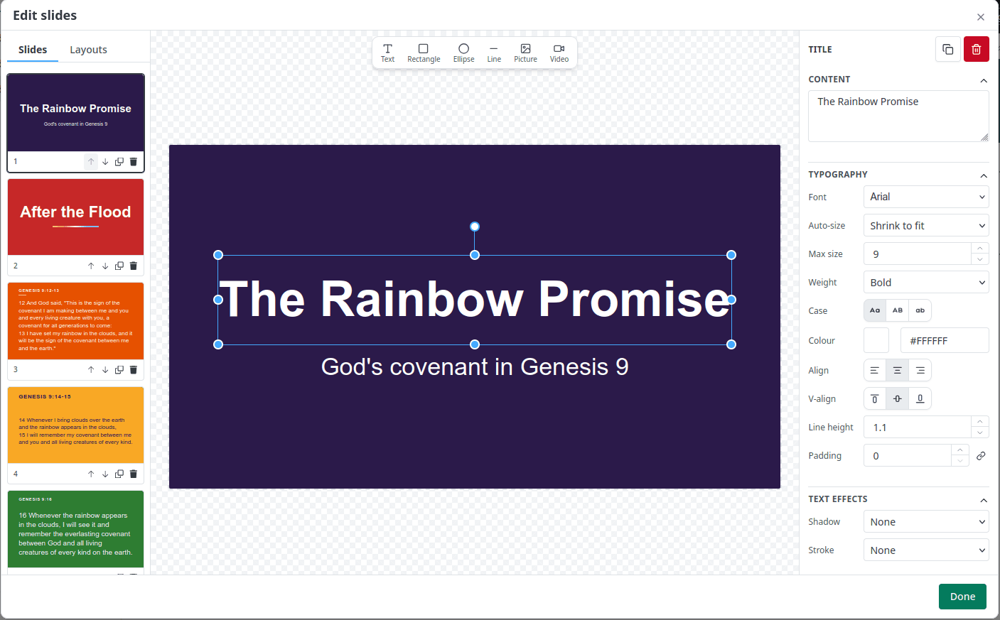
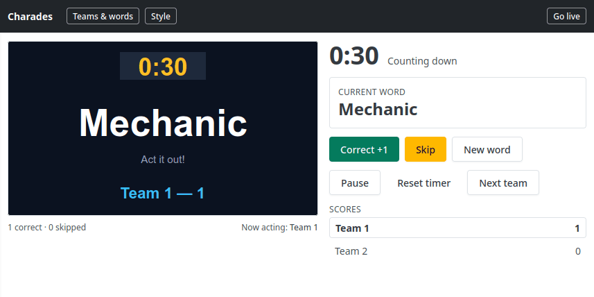

This month we had 187 commits! Though it might not look like much on the user side, the changes we did this month changes how we design plugins for the foreseeable future.

Here's what landed:

## A new layout engine

Until now, every plugin drew its own output. Lyrics had its own way of positioning text, the Bible plugin had another, and the stage display had a third. That meant a styling option added in one place never showed up in the others.

So we built a single layout engine and moved everything onto it. A layout is now a document of elements (text, shapes, images, video) with placement, styling and fitting rules. The renderer, the stage display, the Bible plugin and slides all read from the same thing.

*Layout editor in action*

The visible part of that work is the layout editor. Through August it grew from something simple into something that works like PowerPoint.

There's also a text fitting algorithm doing the hard work of making a long verse fill the frame without overflowing it.

What this means for most people is that they can now style their output however they want. **We provide a good default, you customize it to your liking.**

## AI that edits your slides

We shipped an AI capability this month.

There's now an AI chat panel that can make changes to a layout. Edits to the document you're working on: change the text, move things, restyle. It streams as it works, and it calls tools against the same layout document you're editing, so anything it does is something you could have done by hand and can undo.

This is the opposite approach to what some office apps do. I wrote about why in [Google Slides AI is laughably bad](/blog/google-slides-ai-is-laughably-bad): if the AI can't touch your actual file format, all it can hand you back is a picture. Ours can touch the document.

The AI is configurable at the server level, so self hosters bring their own provider and key rather than being tied to ours.

## Custom Slides

We added the same layout capability into slides. This means that you can create slides easily through TheOpenPresenter now.

For some of you, this means that you can play video directly from the slides plugin. You may be familiar with this workflow from other software such as ProPresenter.

Simply click the slide and a video will play.

> In the background, we made this run much better by preloading it before you need to start the video

## Client plugins

This is the one that changes what TheOpenPresenter can be.

Up until now, adding a plugin meant writing code, committing it to the repository and waiting for a release. That works for us, but it means every idea has to go through us. If your church needs something specific, like a countdown to your service in your own style, a rota display, or a sermon notes panel, your only options were to convince us to build it or fork the whole project.

Now you can write a plugin from inside the app. Head to your organization's plugins page and you get a code editor, a file explorer and a publish button.

A plugin is authored in React, exactly the same way our built in plugins are. You write a `remote.tsx` for what the operator sees, a `renderer.tsx` for what goes on the screen, and a `manifest.ts` describing your plugin and the shape of its data. That's it. The same `usePluginAPI()` hook our own plugins use is what you use, so scene data, renderer state and the sync between devices all work without you thinking about it.

When you publish, the server builds your source into a real plugin, versioned. Your organization can pin to a specific version or track the latest, and you can toggle a plugin on and off without deleting it. There's a test build step before publishing so a broken plugin can't take down your Sunday.

There's an AI chat panel built into the plugin editor too. Since the AI already knows how to work with our layouts and plugin API, describing what you want is a genuinely reasonable way to start.

Here's an example of me creating a charades plugin in just a few minutes:

I think this is very exciting! Give it a try and let us know if you've got any feedback. You may need to enable experimental features under your organization settings to see this.

## And a lot more things!

**Canva import.** We added Canva integration, including connecting more than one Canva account.

**Under the hood.** A shared runtime and shared module bundle so packages aren't duplicated across apps, ESM only plugin builds, Hocuspocus and Zod upgrades, a minimum Node version pinned to LTS, plus prod, Windows and macOS build fixes. Boring, but it's the reason the above could ship as fast as it did.

## What's next

The layout engine and client plugins are the foundation for a lot of what's coming: more of our own plugins rendering through the layout engine, more AI capability on top of it, and a marketplace so plugins can be shared between churches.

If you hit something that looks wrong, especially in the Bible plugin or the stage display now that they've moved onto the new engine, please tell us. That's the fastest way for it to get fixed.
