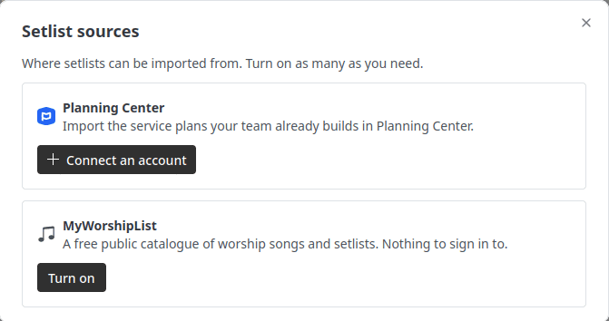
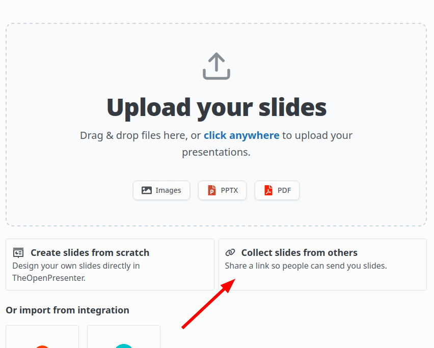

September is a month full of features across the full range of the platform! While they might not be flashiest, these are features that will make daily operations much easier.

## Planning Center integration

If your church plans services in Planning Center, you can now connect it and import a setlist directly.

Connect your account once in the setlist sources screen, then pick a plan and the songs come across with their lyrics and keys, matched against songs you already have so you don't end up with duplicates.

*Connect Planning Center from the setlist sources screen*

If you want any other integration, send us a message and we'll look into it.

## Let others upload their own slides - Upload links 

Tired of receiving your slides last minute and having to load them?

With the new upload links feature, you can generate a link and **have your speaker upload it directly.**.
The best part of this is: Everything will be processed directly. No more converting files or having to put them to the right place.

*Share a link and let others send you their slides*

Our vision is to eventually make this the easiest way to plan for a camp or when there are many slides or speakers.

## Chords

The lyrics plugin understands chords better now.

You can write them, edit them, and see them on the song sheet. We support ChordPro and OpenSong style chord placement and convert between them, so songs imported from elsewhere keep their chords instead of arriving as a wall of lyrics.

There's a chord toolbar in the editor for inserting chords without fighting the text cursor, instrumental bars are handled properly, and the song key is set on import and shown with the song. If you have older songs that came in from MyWorshipList, the app offers to upgrade their chords to the new format.

In October, we will be adding views for your worship team to be able to see the chords directly in their confidence monitor

## Confidence monitor upgrade

In August we moved rendering onto the layout engine. In September we made it do something it couldn't before.

Two new ideas:

**Host elements.** A layout can now contain a live element that shows whatever the plugin is currently presenting. So a confidence monitor layout is just a layout: the live output in a box, your own text around it, styled however you want.

**Derivations.** A host element doesn't have to show the live slide. It can show the next one, or the previous one, or the live slide plus speaker notes. That's a setting on the element, not a separate feature, and it works across lyrics, Bible and slides.

**Data feeds.** You can pull named values into any text in a layout with tokens like `{{next.notes}}`. Set up a feed, point it at a source, and the text updates as you present.

Put together, that means the stage display you wanted is something you can build yourself, rather than something we have to ship for you. Next slide, current slide, speaker notes, your own labels, your own styling.

The confidence monitor screens were rebuilt on top of all this, which deleted a good chunk of code along the way.

## Quality of life changes

**A Slido plugin.** Paste a Slido link or event code and present your poll or Q&A as a scene.

**Better embed UI.** The embed plugin got a much nicer setup flow and is more forgiving about the URLs you paste at it.

**Speaker notes on import.** Importing a PowerPoint file now brings the speaker notes with it, which is much more useful after our confidence monitor upgrade above.

**Duplicate a project.** Copy last week's service and edit it, instead of rebuilding it. You can also assign a project to a screen from the dashboard.

And we went through the platform as a whole to make it much more intuitive and easier to use!

## What's next

**A new desktop app.** This is the one we're most excited about and it's nearly ready.

We've rebuilt the desktop app from scratch. The old one was Tauri, with separate screen apps per platform, and it never really worked on macOS because the system web view mangles media playback. While it worked, it had some issues that makes it not very reliable for production use.

With this rework, we've separated it into a few components that makes it much easier to test and confirm that everything works. All of our learnings from the first version is now culminating to this new version.  

Expect it in your hands in October!
